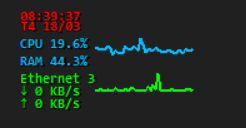

# Đồng hồ nổi góc trái

System Overlay Monitor
======================

Mini overlay hiển thị thông tin hệ thống theo thời gian thực, gọn nhẹ và luôn hiển thị trên màn hình.

* * *

Tính năng chính
---------------

*   ⏰ **Digital clock**
    *   Hiển thị giờ dạng số rõ ràng (HH:MM)
    *   Kèm thứ và ngày tháng
*   🧠 **CPU**
    *   Hiển thị % sử dụng CPU
    *   Có **mini graph** realtime bên cạnh
*   💾 **RAM**
    *   Hiển thị % RAM đang sử dụng
*   🌐 **Network**
    *   Tự nhận diện WiFi hoặc Ethernet
    *   Tự động chuyển đơn vị:
        *   KB/s ↔ MB/s
    *   Hiển thị:
        *   Download (có mini graph)
        *   Upload
*   📊 **Mini Graph**
    *   CPU và Network có đồ thị nhỏ
    *   Vị trí cố định, không bị nhảy

* * *

Trải nghiệm
-----------

*   🪟 **Click xuyên cửa sổ**
    *   Không ảnh hưởng thao tác chuột
*   🎮 **Không bị che bởi fullscreen game**
    *   Luôn hiển thị trên cùng
*   🧊 **Giao diện trong suốt**
    *   Không nền, gọn nhẹ
*   🖱️ **Di chuyển linh hoạt**
    *   Giữ SHIFT + kéo chuột để di chuyển

* * *

Hiệu năng
---------

*   Nhẹ, chạy nền ổn định
*   Không cần cài Python
*   Chạy bằng file `.exe`

* * *

---
Powered by [ChatGPT Exporter](https://www.chatgptexporter.com)